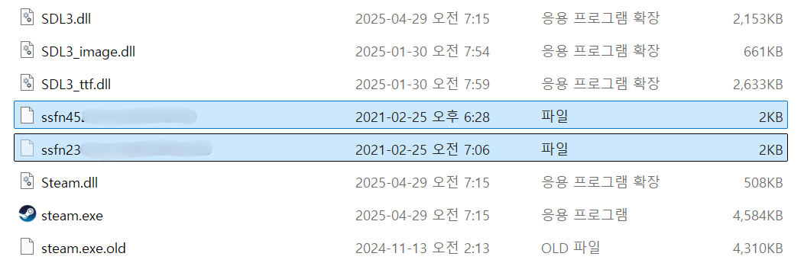
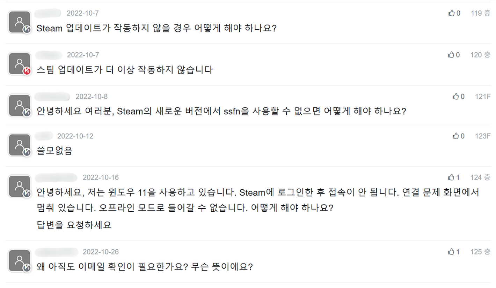
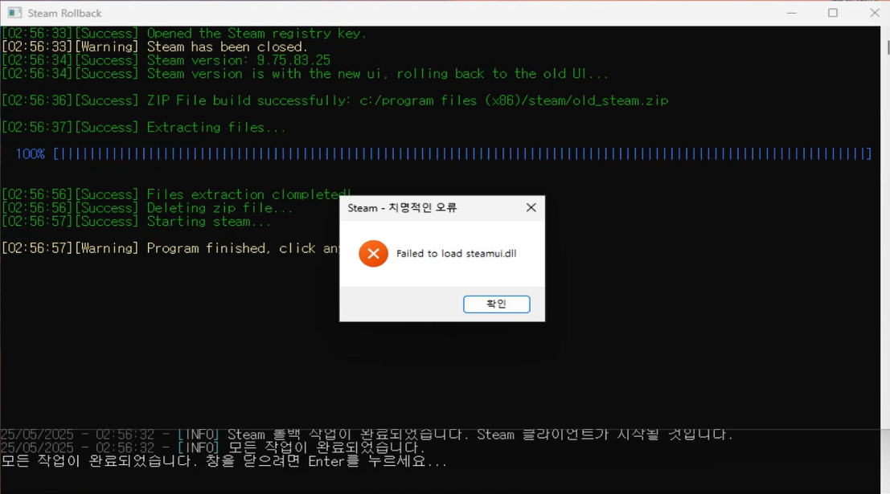

# Steam 계정 보안 메커니즘의 진화에 따른 인포스틸러 위협 모델링 및 분석
## 프로젝트 개요 및 목표

최근 게임 플랫폼은 가상 자산과 계정 정보가 집중된 특성 때문에 공격자들의 주요 표적이 되고 있다. 특히 Steam은 수억 명의 사용자를 보유한 대형 플랫폼으로, 다양한 인증 우회 시도가 꾸준히 공유되어 왔다.

이번 프로젝트는 예전에 알려졌던 SSFN 파일 기반 인증 우회 방식에 대한 관심에서 출발했다. 현재도 이 방식이 여전히 유효한지 확인해보는 과정에서, Steam 클라이언트의 보안 구조와 업데이트 방식이 이와 같은 시도에 어떻게 반응하는지를 실험적으로 살펴보게 되었다.

더불어, 현재 시점에서 공격자들이 어떤 공격 방식을 활용하고 있는지를 알아보기 위해, 인포스틸러 악성코드가 Steam 계정 정보를 어떻게 노리는지를 모델링하고 이를 간단한 시뮬레이션 형태로 구현해보았다.

<br>

## 1. Steam 계정 보안 및 인증 메커니즘 분석 (과거 ~ 현재 시점)

### 1.1 Steam 인증의 주요 요소

#### SSFN 파일

Steam은 장치 인증을 위해 SSFN(Steam Sentry)이라는 이름의 바이너리 파일을 사용해왔다. 이 파일은 한 번 인증된 장치에서 재로그인 시 추가 인증 과정을 생략하도록 해주는 일종의 로컬 토큰처럼 사용된다. 이 파일은 `Steam/` 디렉터리 아래 존재하며, 이름은 `ssfn숫자` 형식을 따른다.



Steam의 인증 절차는 공식적으로 공개되어 있지 않지만, SSFN 파일은 과거 해커들의 주요 공격 벡터로 지목되며 일반 사용자들에게도 비교적 잘 알려져 있다. 다만 프로젝트를 진행하던 중, 중국 공유 사이트 포럼 등에서 2022년 10월 7일경부터 SSFN 파일을 이용한 2FA 우회 방식이 더 이상 작동하지 않는다는 경험담들이 여럿 올라온 것을 확인했다.



이에 Steam 클라이언트의 공식 업데이트 내역을 확인한 결과, 2022년 10월 7일 업데이트에서 로그인 UI 개선 사항이 발표되었고, 이어서 2022년 10월 12일 업데이트에서 QR 코드 인증 방식이 새롭게 도입된 것을 확인할 수 있었다. (참고: [2022년 10월 7일 업데이트](https://store.steampowered.com/news/app/593110/view/3329873512156647585), [2022년 10월 12일 업데이트](https://store.steampowered.com/news/app/593110/view/3329873512156647585) ) 이 시점부터 전반적인 Steam Guard 로그인 프로세스 개편이 이루어진 것으로 보이며, SSFN 파일이 더 이상 이전과 같은 방식으로 사용되지 않는 흐름이 관찰됐다.

#### `loginusers.vdf` 파일

Steam은 `loginusers.vdf`라는 파일에 오프라인 로그인 정보와 계정 정보를 저장한다. 이 파일은 `Steam/config` 디렉터리에 존재하며, 사용자 이름, SteamID, RememberPassword 여부 등이 기록되어 있다. 이 역시 세션 유지와 관련해 공격자들이 관심을 가질 수 있는 요소 중 하나로 보인다.

<br>

### 1.2 Steam 클라이언트의 업데이트 및 무결성 검사 강화

#### Steam의 강력한 자동 업데이트 메커니즘

Steam은 클라이언트의 무결성을 주기적으로 검사하고, 클라이언트 버전이 최신이 아닐 경우 강제로 업데이트를 진행한다. 이번 실험에서는 이 업데이트 강제 정책이 어떻게 동작하는지를 확인해보기 위해, 구 버전 클라이언트를 실행하려는 시도를 해보았다.

이와 관련해 다음과 같은 시점의 보안 관련 변경사항들이 확인됐다:

-   **2022년 10월** 로그인 UI 전면 개편, QR 인증 도입: SSFN 기반 인증 방식 구조 개편 가능성
-   **2025년 2월~4월** 압축 알고리즘 변경(Zstandard 적용): Valve 관계자에 따르면 이 변경은 오래된 클라이언트가 더 이상 제대로 작동하지 않도록 의도된 것으로, 구형 클라이언트가 최신 Steam 서버와 온라인 통신하기 어렵게 만들어 악용 시도를 더욱 어렵게 만든다. (참고: [2025년 2월 압축 알고리즘 관련 뉴스](https://www.yahoo.com/tech/steam-could-download-games-faster-163621426.html), [2025년 4월 업데이트 뉴스](https://news.itsfoss.com/steam-client-april-2025-update/))

이러한 변화들을 종합적으로 보면, SSFN 파일만으로 로그인을 우회할 수 있었던 시점은 이미 오래전에 막혔을 가능성이 높아 보였다. 클라이언트 자체의 구조 변화와 서버-클라이언트 간의 프로토콜 업데이트가 동시에 이루어졌기 때문이다.

<br>

## 2. Steam 클라이언트 다운그레이드 및 보안 방어선 탐색

### 2.1 실험 환경

Steam 클라이언트의 보안 구조를 테스트하기 위해, 가상 머신 환경에서 Windows 환경을 구성하고 실험을 진행했다. SSFN 관련 테스트는 개인 계정에서 추출한 파일로 제한적인 범위 내에서만 진행했다.

### 2.2 `steam-rollback.exe` 기반 다운그레이드 시도

초기에는 GitHub에 공개된 `steam-rollback.exe` 툴을 활용해 구버전 클라이언트로 롤백을 시도했다. 과거 SSFN 우회 시도들이 주로 다운그레이드와 함께 이루어졌다는 점에서, 이 방법이 여전히 가능한지를 확인하고자 했다. 하지만 시도 과정에서 두 가지 다음과 같은 문제가 발생했다.

1.  환경 종속성 문제: 툴 실행 시 `MSVCP140.dll` 누락 오류가 발생했으나, Microsoft Visual C++ Redistributable 설치로 해결했다.
2.  클라이언트 로드 실패: 이후 Steam이 `steamui.dll`을 정상적으로 로드하지 못하고 실행에 실패했다. 이는 툴이 덮어쓴 파일의 버전 불일치 혹은 손상 때문으로, 클라이언트 무결성 검사를 통과하지 못한 것으로 판단된다.  



이 과정을 통해 외부 툴만으로는 Steam의 자동 업데이트를 막기 어렵고, Steam이 클라이언트 무결성 검사를 통해 구버전 실행을 차단하고 있다고 추측할 수 있었다.

<br>

### 2.3 웹 아카이브 기반 수동 다운그레이드 구현

툴 기반 접근이 막히는 상황에서, Steam 커뮤니티에서 소개된 `web.archive.org` 링크를 참고하여 수동 다운로드 방식의 실험을 진행했다. 해당 접근을 자동화하기 위해 Python으로 실행 로직을 구성했다. 이 방식은 Steam 실행 시 특정 인수들을 주어, 과거 버전 패키지를 강제로 다운로드하도록 유도하는 접근이다.

#### 구현 내용 요약

-   명령줄 인수 조합: `Steam.exe`에 `-forcesteamupdate`, `-forcepackagedownload`, `-overridepackageurl` 등의 인수를 전달하여 Steam 클라이언트가 `web.archive.org`에 보관된 특정 구 버전(Manifest ID `1685488080`, 2023년 5월 31일 빌드) 패키지를 자체적으로 다운로드하게 유도

```py
launch_command_download = [ f'"{self.steam_exe_path}"', "-forcesteamupdate", "-forcepackagedownload", f"-overridepackageurl {manifest_url_base}", "-textmode", "-exitsteam", # 다운로드 완료 후 Steam이 스스로 종료되도록 함 "-clearbeta" ]
```

-   업데이트 방어 우회 로직 추가
    -   `steam.cfg` 파일(`BootStrapperInhibitAll=enable`)을 Steam 설치 경로에 생성하여 Steam의 자동 업데이트 부트로더를 비활성화
    -   `loginusers.vdf` 파일을 수정하여 오프라인 모드 로그인 강제
    -   `subprocess` 모듈을 활용하여 Steam 프로세스 강제 종료 및 클라이언트 실행
-   네트워크 차단 시도: `steam.cfg`를 통한 소프트웨어적 방어만으로는 Steam의 즉각적인 업데이트 시도를 완전히 막기 어렵다고 판단했기에 실행 직후 빠르게 네트워크를 차단하는 방식도 함께 실험했지만, Steam의 업데이트 루틴이 매우 빨리 작동해 현실적으로 타이밍을 맞추기 어려웠다.

<br>

### 2.4 실험 결과 및 관찰 내용

-   클라이언트는 구 버전 패키지를 일단 다운로드하는 듯했지만, 실행 직후 최신 서버와 통신하여 바로 업데이트를 시작했다.
-   네트워크를 미리 차단해도 steamui.dll 오류가 발생하거나 클라이언트가 로드되지 않았다.
-   전체적으로 Steam의 자동 업데이트 및 무결성 검사가 클라이언트 수준에서 매우 강력하게 작동하고 있음을 확인할 수 있었다.

또한, 2025년 5월 기준 신규 가입 계정에서는 장치 인증을 설정해도 SSFN 파일이 새로 생성되지 않는 것을 확인했다.

이러한 결과를 바탕으로, 구버전 클라이언트를 통한 SSFN 기반 우회 방식은 현재 구조에서는 실현 가능성이 낮다고 판단하게 되었다. 이와 같은 클라이언트 차단 구조가 자리잡은 만큼, 현재의 공격자들은 다운그레이드보다는 사용자의 세션 정보(예: 브라우저 쿠키, loginusers.vdf) 등을 직접 노리는 방향으로 전략을 전환했을 가능성이 있어 보였다.

<br>

## 3. 인포스틸러의 Steam 계정 탈취 위협 모델링

Steam의 클라이언트 구조와 업데이트 정책을 살펴본 이후, 자연스럽게 떠오른 질문은 다음과 같았다. 그렇다면 현재 공격자들은 어떤 방법으로 계정 탈취를 시도하고 있을까? 이를 파악하기 위해, 최근까지도 활동 중인 인포스틸러 악성코드들의 동작 방식을 분석해보았고, 그 흐름을 기반으로 간단한 시뮬레이션도 작성해 보았다.

### 3.1 일반적인 인포스틸러의 Steam 세션 탈취 방식에 대한 가설

정보 탈취형 악성코드(Infostealer)는 보통 실행 중인 프로그램을 공격하지 않더라도, 로컬 시스템에 저장된 인증 정보를 추출해 탈취하는 방식으로 동작한다. Steam의 경우, 아래와 같은 요소들이 탈취 대상으로 활용될 수 있을 것으로 보였다:

-   Steam 디렉토리 내 ssfn 파일
-   Steam/config/loginusers.vdf: 계정 ID, 로그인 기록, RememberPassword 여부 등
-   같은 경로 내 기타 설정 파일
-   브라우저에 저장된 steamLoginSecure 쿠키
-   메모리 내 활성 토큰 (예상)

이러한 항목들은 로컬 파일 접근, 레지스트리 접근, 브라우저 쿠키 DB 접근 또는 메모리 스캔을 통해 수집될 수 있으며, 수집된 정보는 일반적으로 압축 후 외부 서버(C2)로 전송된다.

### 3.2 SaintStealer와 VidarStealer 사례 분석

Steam 계정 탈취를 목적으로 하는 인포스틸러 중 대표적인 두 사례인 SaintStealer와 VidarStealer를 분석해보았다. 두 악성코드는 세대 차이를 반영하듯 서로 다른 전략을 사용하지만, 모두 Steam을 주요 표적으로 삼고 있으며 점점 고도화되는 모습을 보여주고 있었다.

#### 3.2.1 SaintStealer (2022년 4월 분석 기반)

SaintStealer는 2022년경 활동하던 .NET 기반 악성코드로, 패킹되지 않아 코드 분석이 비교적 용이한 편이다. SaintStealer의 주요 기능은 다음과 같다.

-   환경 회피 기능:  
    실행 전 중복 실행 여부, 샌드박스 환경, RDP 접속 여부, 가상 머신 탐지 등을 통해 분석 환경일 경우 자동 종료하는 구조가 포함되어 있었다.
-   Steam 경로 탐색 및 정보 수집:  
    Windows 레지스트리 키 `HKEY_CURRENT_USER\Software\Valve\Steam`에서 `SteamPath` 값을 추출하여 설치 경로를 얻고, 해당 경로 하위에서 Steam 관련 민감 정보를 탐색했다. 특히 다음 항목을 명시적으로 수집 대상에 포함하고 있었다:
    -   ssfn\* 형식의 장치 인증 토큰 파일
    -   Steam/config 경로 내의 loginusers.vdf, config.vdf 등 계정 설정 파일
-   데이터 압축 및 유출 방식:  
    수집한 정보는 ZIP으로 압축된 뒤 텔레그램 메시지 첨부 파일 형태로 C2 서버로 전송되었다. 당시 기준으로 보면, SSFN 파일 기반 인증 우회 시도가 여전히 일부 성공 가능성이 있었던 시점이었기에, 이 구조는 실질적인 계정 탈취에 사용되었을 가능성이 있다.

이 분석을 통해 당시 인포스틸러는 Steam의 인증 구조 중 로컬 파일 기반의 취약 지점에 주로 집중하고 있었음을 확인할 수 있었다.

#### 3.2.2 `VidarStealer` (2025년 분석 기반)

VidarStealer는 2018년부터 꾸준히 진화해온 악성코드로, 2025년 현재까지도 다양한 방식으로 변종이 제작되고 있으며, 그 중 상당수가 Steam 계정을 수집 대상으로 삼고 있었다.

-   C2 통신 우회 전략:  
    초기에는 고정된 C2 주소를 사용했으나, 점차 중간 C2 주소를 유명 플랫폼에 숨기는 방식으로 발전했다. 구체적으로는 다음과 같은 방식이 확인되었다:
    -   **2021년 5월**: Faceit 프로필 페이지를 중간 C2로 활용해 진짜 명령 주소를 은닉
    -   **2022년 12월**: Steam 커뮤니티, Telegram, Mastodon, TikTok, Ultimate Guitar 등 다양한 공개 플랫폼 URL에 C2 주소를 삽입. 차단 회피와 함께 탐지 우회를 도모함
    -   데이터 전송 시에는 Base64 인코딩과 함께 특정 토큰 값을 포함시켜 탐지 회피
-   **최신 유포 방식 및 회피 기법 (2025년 4월 분석)**:  
    2025년에 들어서는 더욱 정교한 유포 및 실행 구조가 확인되었다:
    -   Steam 게임인 PirateFi의 베타 버전에 멀웨어를 은닉하여 실제 플랫폼 유통망을 통한 확산 시도
    -   `Microsoft Sysinternals` 도구인 `BGInfo.exe`로 위장. 서명이 만료된 실행 파일을 악용하여 탐지 회피
    -   `RtlUserThreadStart` 포인터를 변경해 실제 `VidarStealer` 본체를 메모리에 동적으로 로드하고, 기존 실행 흐름을 하이재킹하는 고급 기술 사용

#### 3.2.3 Steam 탈취 전략의 진화

VidarStealer 관련 자료 중 일부에는 Steam 계정 탈취 기능이 명시되어 있으며, 특히 세션 토큰을 수집 대상에 포함한다는 설명이 확인된 바 있다. 다만 구체적으로 어떤 방식으로 수집이 이루어지는지, 어떤 경로에서 토큰을 추출하는지는 공개된 분석 자료만으로는 명확히 확인되지 않았다.  
과거 SaintStealer가 SSFN 파일이나 `loginusers.vdf`와 같이 로컬에 저장된 인증 정보를 수집했던 반면, 최근의 VidarStealer는 보다 간접적인 형태의 인증 정보를 노리는 쪽으로 기능이 전환된 것으로 추정되었다.  
Steam이 클라이언트 인증 구조를 지속적으로 개선해온 만큼, 공격자들이 더 이상 SSFN 파일에 의존하지 않고 세션 유지에 활용되는 다른 방식의 인증 정보를 겨냥하려는 경향이 생겼을 수 있다는 해석이 가능해 보였다. 다만 이 역시 일부 분석 내용과 추론을 바탕으로 한 것으로, 실제 수집 방식은 추가적인 샘플 분석이 필요하다.

<br>

### 3.3 인포스틸러 정보 수집 및 유출 준비 시뮬레이션 (`session_probe.py`)

앞서 분석한 인포스틸러의 Steam 계정 탈취 전략을 바탕으로, 실제로 어떤 순서와 방식으로 민감 정보가 수집될 수 있는지를 확인하기 위해 간단한 시뮬레이션 스크립트를 구현했다. 이 스크립트는 일반적인 인포스틸러가 따를 수 있는 정보 수집 흐름을 Python으로 재구성한 것으로, 구체적인 파일 탐색, 쿠키 추출, 압축 처리 등의 절차를 직접 따라가며 확인할 수 있도록 설계했다.

코드는 `src/util/session_probe.py`에서 확인 가능하다.

#### 3.3.1 정보 수집 흐름 재구성

다음과 같은 수집 단계를 순차적으로 수행하도록 시뮬레이션을 구성했다.

1.  Steam 설치 경로 탐색
    -   레지스트리를 통해 Steam의 설치 경로(`SteamPath`)를 동적으로 탐색한다.
    -   Windows 기준 경로: `HKEY_CURRENT_USER\Software\Valve\Steam`.
2.  Steam 클라이언트 내 핵심 파일 수집
    -   Steam 디렉터리 내 `ssfn*` 파일을 탐색해 수집 대상에 추가하고, 각 파일의 크기와 수정 시간을 함께 기록한다.
    -   `Steam\config` 경로의 `loginusers.vdf` 파일을 정규표현식으로 파싱해 SteamID, 계정명, RememberPassword 설정 등을 추출한다.
    -   같은 폴더 내의 다른 `.vdf` 파일들도 목록화하여 보조 정보로 취급한다.
3.  브라우저 기반 세션 요소 탐색
    -   Chrome/Edge의 사용자 프로필 경로(`User Data/Default`, `Profile 1`, `Profile 2` 등)를 순회하면서 각 프로필의 쿠키 데이터베이스(`Network/Cookies`)에 접근한다.
    -   `sqlite3`를 통해 쿠키 DB를 열고, `'steamLoginSecure'` 쿠키의 존재 여부 및 `host_key`, `path`, `encrypted_value` 값을 추출하여 기록한다.
4.  수집된 정보 압축 처리
    -   앞에서 수집한 모든 파일을 `zipfile` 모듈로 압축한다.
    -   쿠키 DB 파일은 브라우저 실행 중 접근 불가한 경우가 많기 때문에 임시 복사본을 만들어 ZIP에 포함시킨다.

#### 3.3.2 주요 구현 포인트

다음은 실제 `session_probe.py`의 주요 구현 내용이다:

-   레지스트리에서 설치 경로 획득
    
    ```
    with winreg.OpenKey(winreg.HKEY_CURRENT_USER, r"Software\Valve\Steam") as key:
      steam_path = winreg.QueryValueEx(key, "SteamPath")[0]
    ```
    
-   SSFN 파일 수집 및 메타데이터 기록
    
    ```
    ssfn_files = glob.glob(os.path.join(steam_path, "ssfn*"))
    for path in ssfn_files:
      size = os.path.getsize(path)
      mtime = os.path.getmtime(path)
    ```
    
-   loginusers.vdf 파싱 (정규표현식으로 계정명 추출)
    
    ```
    with open(loginusers_path, 'r', encoding='utf-8') as f:
      content = f.read()
    match = re.search(r'"AccountName"\s+"(.+?)"', content)
    ```
    
-   브라우저 프로필 순회 및 쿠키 조회
    
    ```
    cookie_query = "SELECT host_key, path, encrypted_value FROM cookies WHERE name='steamLoginSecure'"
    conn = sqlite3.connect(cookie_db_path)
    cursor = conn.cursor()
    cursor.execute(cookie_query)
    ```
    
-   ZIP 압축 처리
    
    ```
    with zipfile.ZipFile(output_path, 'w') as zipf:
      zipf.write(ssfn_path)
      zipf.write(loginusers_path)
      zipf.write(temp_cookie_db_copy)
    ```

<br>

#### 3.3.3 트러블슈팅: 쿠키 DB 접근 오류

초기 실행 중 Chrome 브라우저가 열린 상태에서 Cookies 파일을 복사하려 했을 때 `[Errno 13] Permission denied` 오류가 발생했다. 이는 SQLite DB 파일이 브라우저에 의해 잠겨 있었기 때문으로 파악되었다.

-   해결 방법: 스크립트 실행 전 브라우저 프로세스를 수동으로 완전히 종료하고 재시도했다.
-   결과: 임시 복사본을 활용한 방식으로 정상 접근 가능함을 확인하였다.

<br>

## 4. 결론 및 시사점

이번 프로젝트는 Steam 계정 보안 구조에 대한 개인적인 궁금증에서 출발해, 과거 인증 우회 방식이 현재에도 여전히 가능할지를 실험적으로 확인해보려는 시도였다. 특히 SSFN 파일을 통한 우회 방식이 더 이상 통하지 않는다는 이야기를 접하고, 실제로 그것이 어떻게 차단되고 있는지를 기술적으로 검증해보고자 했다.

Steam 클라이언트를 구버전으로 롤백하려는 시도는 Steam의 무결성 검사와 자동 업데이트 메커니즘 때문에 사실상 불가능했다. 클라이언트를 실행하는 즉시 서버와 통신하여 강제로 최신 버전으로 덮어쓰는 동작이 이루어졌고, 네트워크 차단을 시도해도 타이밍상 선제 대응이 어려웠다. 이런 실험을 통해 느낀 건, SSFN 파일만으로 인증 우회가 가능했던 구조는 Steam의 구조 변화와 함께 실질적으로 사라졌다고 봐야 할 것 같다는 점이었다.

한편으로는 공격자 입장에서 예전처럼 클라이언트를 조작하거나 롤백하는 방식보다는, 사용자의 시스템 내부에 남아 있는 인증 흔적(예: `loginusers.vdf`, 세션 쿠키 등)을 노리는 방향으로 전략이 바뀌었을 가능성도 함께 고민해보게 됐다.

이런 흐름을 바탕으로, 인포스틸러가 Steam 계정 정보를 어떻게 수집하는지를 모델링한 session\_probe.py 스크립트를 작성해보았다. 레지스트리 탐색, 파일 수집, 브라우저 쿠키 조회, 압축까지 이어지는 과정은 단순한 구현을 넘어서, 실제 악성코드가 어떤 제한 속에서 움직여야 하는지를 이해하는 계기가 됐다. 예를 들어 브라우저 쿠키 파일이 잠겨 있으면 접근이 차단된다는 점을 경험하면서, 공격자는 이 상황을 어떻게 우회할까를 자연스럽게 고민하게 되었다. 이런 관찰은 실제 악성코드 동작을 코드로 이해하는 데 훨씬 큰 도움이 되었다.

### 공격자가 노리는 지점과 사용자 입장에서 주의할 점

실험을 하면서 특히 눈에 띈 건, 세션 쿠키와 `loginusers.vdf` 파일처럼 로컬에 남아 있는 정보들이 생각보다 민감하다는 점이었다. 로그아웃을 하거나 PC를 재시작한다고 해서 자동으로 지워지는 정보가 아니었고, 브라우저 자동 로그인 기능이나 Steam의 RememberPassword 설정이 이런 정보를 장기간 남겨두게 만든다는 것도 확인할 수 있었다.

결국 공격자가 노리는 건 항상 시스템의 허점이라기보다는, 사용자의 설정 습관일 수도 있다는 점을 체감하게 됐다. 2단계 인증을 설정하고, 자동 로그인 기능을 끄고, 평소에 출처가 불분명한 실행파일을 실행하지 않는 것만으로도 실질적인 보안 수준이 크게 올라갈 수 있다.

<br>

## 5. `session_probe.py` PoC 데모 영상
[](https://youtu.be/hgRTmFVzz_w)
<br>
[설명] <br>
`python session_probe.py --install` 명령을 실행하면 시작 프로그램으로 등록된다.
<br>
시스템을 재부팅한 뒤, 아무것도 하지 않고 잠시 기다리면 cmd 창이 빠르게 켜졌다가 사라지는 것을 볼 수 있다.
<br>
그 후 자동으로 `steam-downgrader-main`의 `src/util` 폴더에 압축 파일이 생성된다.